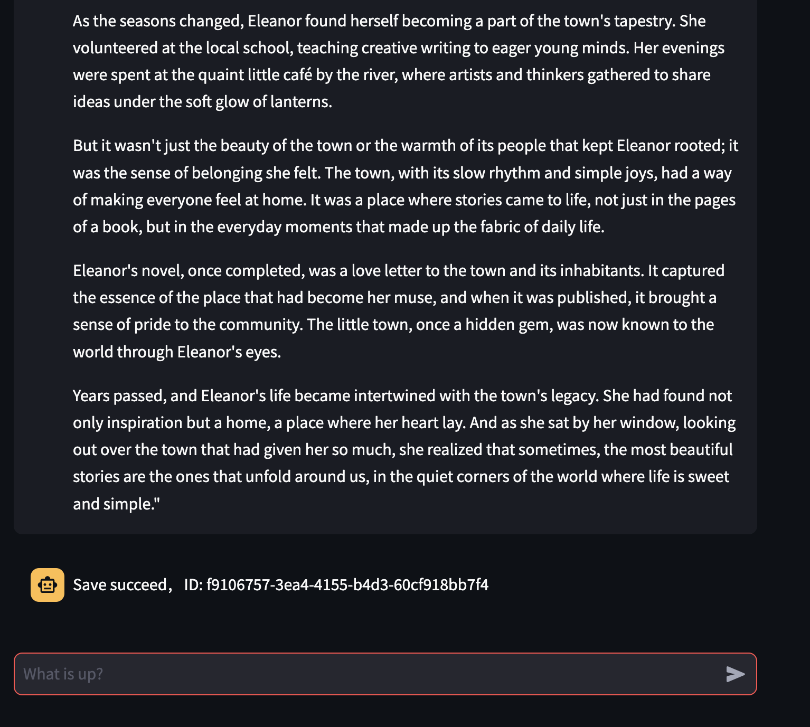
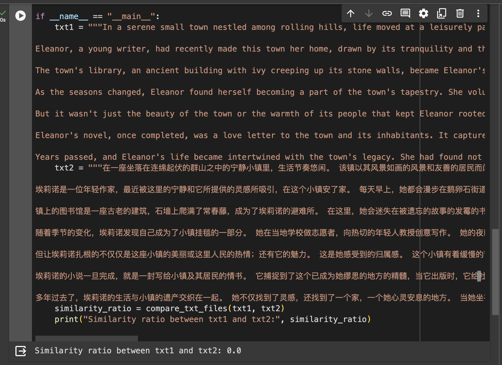
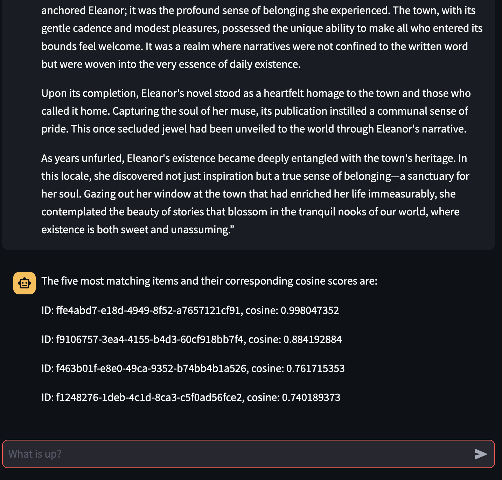

# VectorDataBaseApp

This project utilizes Streamlit for managing API keys. To get started, you need to generate your Pinecone and GPT API keys and place them in `./streamlit/secrets.toml` in the following format:

```toml
gpt-api-key = "your_gpt_api_key_here"
pinecone-api-key = "your_pinecone_api_key_here"
```
Before running the project, ensure you have created your Pinecone database and obtained your GPT API key. Don't forget to update the index value in the code to match the name of your database.

# Running the Project
Use the command below to run the project:
```
python3.8 -m streamlit run main.py
```
This command will open a browser interface.

# How to Use
Upon launching, you will be greeted with an instruction:

"I am your Vector Database assistant bot. How can I assist you? If you need to store content, please input the command: save:[content you want to store]. If you need to perform a comparison, please input the command: get:[content you want to compare]."

However, you can also input in natural language. For instance, you might say "I want to save [article1]". After adding this text into your vector database, the system will respond with a data ID. You can then rephrase article1, input it into the chatbox to see if the Vector Database detects the similarity. The system will return the top 5 similar data IDs along with their similarity scores.

This tool can be particularly useful for detecting plagiarism.


# Demo
Below are the steps and visual aids for using the Vector Database App effectively.

## Launching the App


## Storing an Article
To save an article into the database, follow the format or simply use natural language. The system will store your article and provide a unique data ID as confirmation.


## Rephrasing the Article
After saving the original article, you can rephrase it to test the database's ability to detect similarity.


## Using Rephrased Article as Query Input
Submit the rephrased article as a query to see if the Vector Database can identify the original article based on similarity.


The system will return objects along with their corresponding IDs, showcasing the effectiveness of the similarity detection.

## 对比中英输入
现在我们来使用双语数据集来测试语义识别的能力。我们首先存储一个中文版本的文本再利用英文版本作为查询的输入。并且对比非语义识别SequenceMatcher和Vector Database的识别结果对比。
首先，我们使用SequenceMatcher对比中英版本，可以看到相似度为0.

然后我们把中文版的数据插入vector database.

然后我们使用英文版来查询数据。

可以看到，准确查找到了我们存储的中文版文本，相似度高到0.99.

并且在LLM的帮助下，我们可以使用多国自然语言实现存储和查询的过程。

## Future Enhancements
Looking ahead, the integration with MySQL or other database systems could enable users to not only retrieve data IDs but also access the textual content associated with those IDs. This advancement would enrich the application's utility, making it an even more powerful tool for content management and integrity verification.
